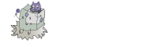

# Welcome to Weak chain
*Weak chain* is a blockchain written in C++20. It's designed to be a working
private chain that's as simple as possible in the hope that it could help you
get started with blockchain.(and probably demythify it....)

